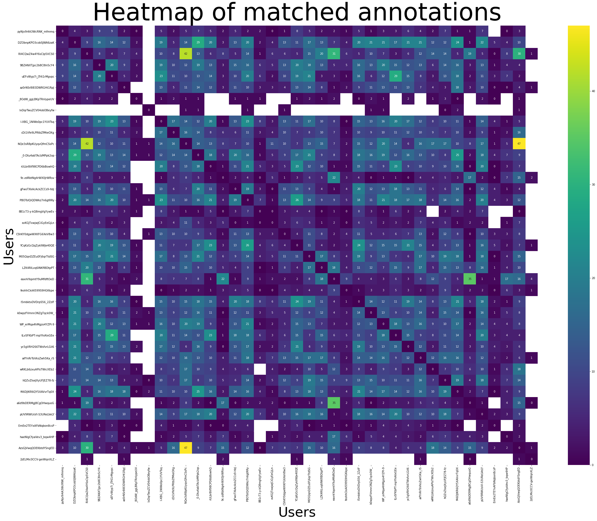
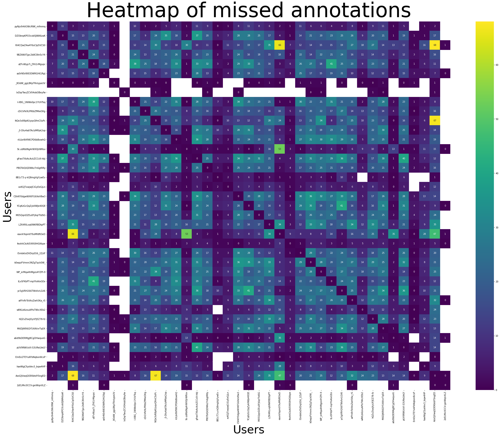

# Twitter annotation user analysis

#### Quickstart

Run:
```
docker-compose up
```

Go to `localhost:8001` to open notebook and copy token generated in console (where you've run the command from). Notebook is in `/work` folder.

#### Data

Data is stored in `data` directory. It has 4 files:

- tweet-annotator-raw-data.json (raw data exported from database)
- ratio_score.csv (annotation ratio matrix for all users)
- miss_score.csv (missed annotations matrix for all users)
- matched_score.csv (matched annotations matrix for all users)

#### Heatmaps



